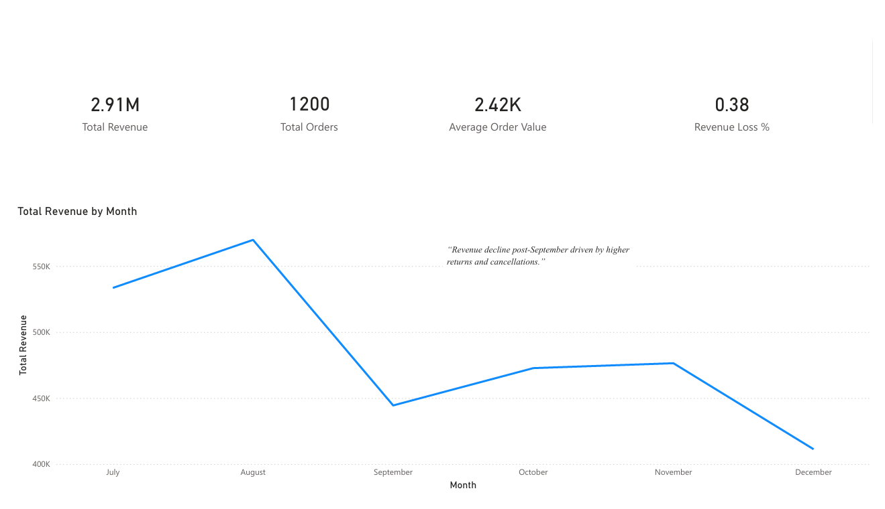
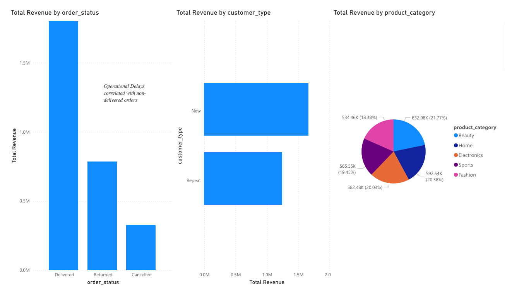
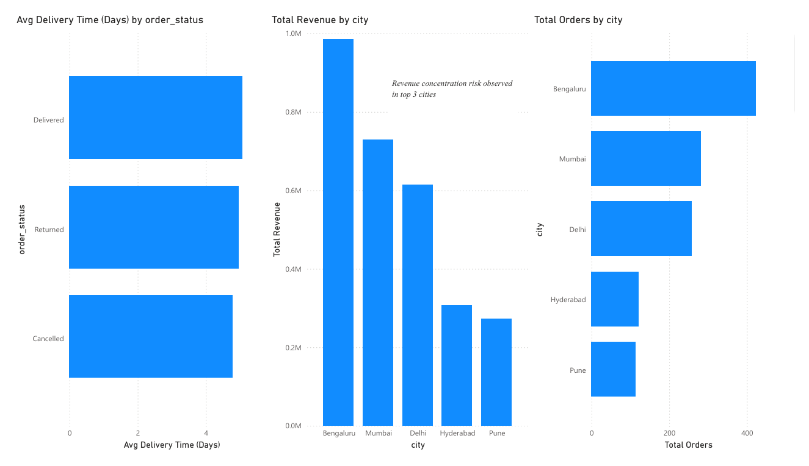

📉 Revenue Decline Diagnostic – E-commerce Analytics Project
📌 Project Overview

This project performs a diagnostic analysis to identify the root causes of revenue decline in a simulated e-commerce business using Python, SQL, and Power BI.
The analysis follows a structured consulting-style framework to move from symptom → diagnosis → insight.

🎯 Business Problem

An e-commerce company observed a sharp revenue decline in the latter half of 2023 despite relatively stable order volumes.
The objective was to determine whether the decline was driven by:

Demand reduction

Pricing & discount strategy

Customer behavior (new vs repeat)

Operational issues (returns, cancellations, delivery delays)

Geographic or category-level performance

🧠 Diagnostic Framework Used

The analysis was conducted using the following structured approach:

Trend Analysis – Revenue & order volume over time

Customer Segmentation – New vs repeat customer contribution

Operational Leakage – Revenue loss due to returns & cancellations

Category Performance – Product-level revenue distribution

Geographic Analysis – City-wise revenue and order concentration

Operational Efficiency – Delivery time vs order outcomes

🛠️ Tech Stack

Python – Data generation & preprocessing

Pandas / NumPy – Data manipulation

SQL – Diagnostic queries & aggregations

Power BI – Interactive dashboard & storytelling

Git & GitHub – Version control

📂 Project Structure
Revenue-Decline-Diagnostic/
│
├── data/
│   ├── raw/                # Empty (data generated via notebook)
│   └── processed/          # Generated CSV (ignored in Git)
│
├── notebooks/
│   └── 01_revenue_decline_diagnostic.ipynb
│
├── sql/
│   └── 01_revenue_diagnostic_queries.sql
│
├── dashboard/
│   └── revenue-decline-diagnostic-dashboard.pbix
│
├── .gitignore
└── README.md
📊 Power BI Dashboard Preview

The Power BI dashboard presents a structured, diagnostic view of revenue decline across time, customer behavior, operations, and geography.

Page 1 – Executive Overview

Purpose: High-level snapshot for leadership to quickly understand the revenue decline.

Key Insights Displayed:

Total Revenue

Total Orders

Average Order Value

Revenue Loss % (Returns & Cancellations)

Monthly Revenue Trend (Jul–Dec 2023)

📷 Dashboard Preview:

Page 2 – Revenue Leakage & Customer Behavior

Purpose: Identify where revenue is being lost and whether demand-side issues exist.

Key Insights Displayed:

Revenue by Order Status (Delivered vs Returned vs Cancelled)

Revenue Contribution by Customer Type (New vs Repeat)

Repeat Orders Trend by Month

📷 Dashboard Preview:

Page 3 – Operational & Geographic Analysis

Purpose: Diagnose operational inefficiencies and regional concentration risks.

Key Insights Displayed:

Average Delivery Time by Order Status

Total Revenue by City

Total Orders by City

Revenue Concentration Risk Across Top Cities

📷 Dashboard Preview:

🔍 Key Insights

Revenue decline post-September is not demand-driven — order volumes remain relatively stable

Returns and cancellations increased, causing significant revenue leakage

Repeat customer contribution remains strong, indicating retained customer trust

Revenue is highly concentrated in top 3 cities, posing geographic risk

Longer delivery times correlate with non-delivered orders, suggesting operational inefficiencies

💡 Business Recommendations

Improve delivery SLAs to reduce returns & cancellations

Audit post-September operational bottlenecks

Diversify revenue sources beyond top cities

Review discount strategies impacting margins

Focus retention strategies on repeat customers

🚀 How to Run the Project

Open and run the Jupyter notebook:

notebooks/01_revenue_decline_diagnostic.ipynb

Load the generated dataset into Power BI

Open:

dashboard/revenue-decline-diagnostic-dashboard.pbix

📈 Skills Demonstrated

Business problem structuring

Diagnostic analytics mindset

SQL querying for insights

Power BI dashboard storytelling

End-to-end analytics workflow

📬 Author

Paras Miglani
B.Tech – Electronics & Communication Engineering
Aspiring Analytics & Consulting Professional